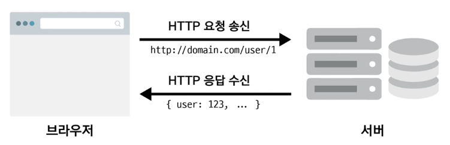

# Axios  
개념: 뷰에서 권고하는 HTTP 통신 라이브러리이다.  
promise기반의 HTTP 통신 라이브러리이며, API가 다양하다는 것이 장점이다.  

## Axios 불러오는법  
`````
  <script src="https://unpkg.com/axios/dist/axios.min.js"></script>
`````  

## 선행되어야할 개념  
  
브라우저와 서버가 통신될 때 HTTP를 통해 요청하고 응답을 받는다.  
예를들면 브라우저에서 유저 정보를 요청을하면 HTTP로 요청을하게되고,  
서버는 유저정보를 DataBase(대표적인게 오라클)에서 추출하여 json({}<-객체형태로 응답)에 담아서 응답해준다.

## Axios의 사용법  
HTTP 통신의 대표적인 방식은 get방식과 post방식이 있다. axios의 get방식 사용을 살펴보자
`````
  <script>
    new Vue({
      el: '#app',
      data: {
        users: []
      },
      methods: {
        //getData라는 메서드에서 axios요청을 할 것이다.
        getData: function() { 
            //사용방식(axios.요청방식(url값)).then(콜백함수).catch(콜백함수)
          axios.get('https://jsonplaceholder.typicode.com/users/')
            .then(function(response) {
            //response는 axios 요청을 통해 응답을 해주는 응답 객체이며 
            //data라는 속성이 존재하는데 응답해준 데이터값이 data라는 속성에 들어오게된다.
              console.log(response.data);
              //뷰에 data로 정의되어있는 users를 지칭하는 this.users를 이용하여 데이터에 넣어준다.
              this.users = response.data;
            })
            .catch(function(error) {
              console.log(error);
            });
        }
      }
    })
  </script>
  ````` 
  