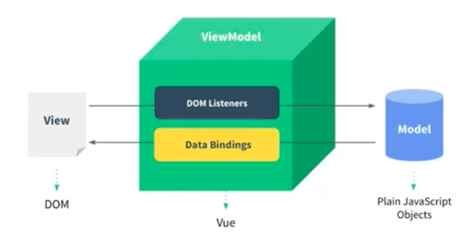
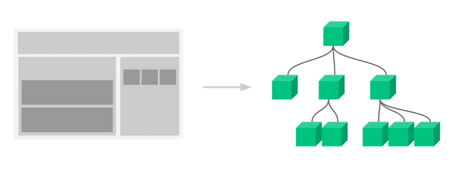
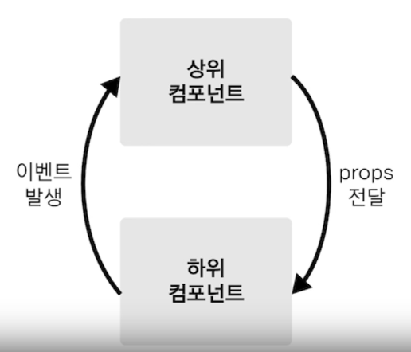
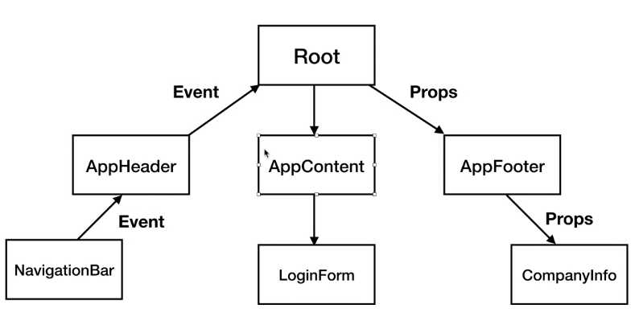
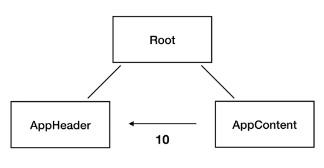
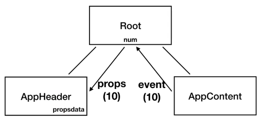

# Vue.js  
&nbsp;&nbsp;  
## 필수적으로 설치할 것들
1. VSCode(플러그인: Vetur, Live Server, HTML Snippets, JavaScript (ES6) code snippets)
2. Vue.js devtools

## Vue란?  
  
MVVM 패턴의 뷰 모델 레이어에 해당하는 화면단 라이브러리.  
쉽게말하면, DOM Listener DOM의 변화(이벤트)를 감지하고 이 데이터를 자바스크립트를 통해 조작하여 Data Bindings를 통해 데이터를 반영한다  
DOM Listener, Data Bindings하는 작업을 Vue.js가 한다.
&nbsp;&nbsp;  
## vue, js차이  
1. javaScript  
`````````
    <div id="app"></div>

    <script>
        const div = document.querySelector('#app');//app이라는 태그를 선택한다.
        console.log(div);
        //div.innerHTML="Hello word"//직접 dom에서 데이터를 넣어주는법과 자바스크립트에서는 이렇게 넣어주는 방식이 있다

        let str = "hello world";
        div.innerHTML=str;//str을 화면에 표시
        str = "hello world!!!" //기본 js에는 str의 스트링이 변해도 감지를 하지못한다.
        div.innerHTML=str;//이렇게 다시 str을 화면에 넣어줘야 데이터가 변화된다.
    </script>
`````````   

2. Vue  
`````````
    <div id="app">
        {{message}}
    </div>

    <script>
        let vm = new Vue({
            el: '#app',
            data: {
                message: 'hi' <--안의 메세지 데이터가 변화하면 그 변화를 감지하여 바로 변화된 데이터가 노출된다.
            },
        });
````````` 

&nbsp;&nbsp;  
## 뷰 가져오는 법  
`````
<!-- CDN방식 -->
<!-- 개발버전, 도움되는 콘솔 경고를 포함. -->
<script src="https://cdn.jsdelivr.net/npm/vue/dist/vue.js"></script>

<!-- 상용버전, 속도와 용량이 최적화됨. -->
<script src="https://cdn.jsdelivr.net/npm/vue"></script>
`````
&nbsp;&nbsp;   


&nbsp;&nbsp;  
## 뷰 인스턴스  
개념: 인스턴스는 뷰로 개발할 때 필수로 생성해야되는 코드  

1. 인스턴스생성  
``````
    <div id="app"></div>

    <script>
        let vm = new Vue({//인스턴스를 생성
            el: '#app'//body태그 안에서 app이라는 아이디를 가진 태그를 찾아서 인스턴스(Vue)를 붙히겠다는 문구<--붙히는 순간에 뷰의 기능을 사용할 수 있게된다.
        });//뷰 인스턴스 생성
        console.log(vm);//뷰의 내용을 확인할 수 있다. 뷰의 API(기능)과 속성을 확인할 수 있다.
    </script>
``````

2. 인스턴스의 속성들  
`````
new Vue({
    el:,//인스턴스가 그려지는 화면의 시작점
    template:,//화면에 표시할 요소(html, css등)
    data:,//뷰의 반응성(Reactivity)가 반영된 데이터 속성
    methods:,//화면의 동작과 이벤트 로직을 제어하는 메서드
    created:,//뷰의 라이프 사이클과 관계된 속성
    watch:,//data에서 정의한 속성이 변화했을때 추가동작을 수행할 수 있게 정의하는 것
})
`````


## 뷰 컴포넌트 
   
개념: 컴포넌트는 화면의 영역을 구분하여 개발할 수 있는 뷰의기능이다.  
컴포넌트 기반으로 화면을 개발하게되면 재사용성이 올라가고 개발시간이 단축될 수 있다.  
또한 컴포넌트는 화면의 각파트 (Header, Footer, Main등)를 그림의 왼쪽과 같이 화면의 영역을 구분하여개발하는 것이며  
영역을 구분했을때 그림의 오른쪽과 같이 컴포넌트간의 관계가 생기게된다.  
  
## 전역 컴포넌트 등록  
````
    <div id="app">
        <!-- 밑에서 선언한 app-header라는 컴포넌트를 사용한다. -->
        <app-header></app-header>
        <app-content></app-content>
    </div>

    <script>
        //Vue.component('컴포넌트이름',컴포넌트내용);<--전역컴포넌트 선언 형식
        Vue.component('app-header',{//app-header라는 컴포넌트를 생성하여 화면에 태그를 표시한다(template)
            template:'<h1>header</h1>'
        })

        Vue.component('app-content',{
            template:'<div>content</div>'
        })
````  
  
## 지역 컴포넌트 등록  
`````
        new Vue({
            el: '#app',
            data: {
                message: 'hi'
            },
            components:{
                '컴포넌트 이름': {컴포넌트내용}  //지역컴포넌트는 components라는 속성을 넣은다음 컴포넌트를 작성해주면된다
            }
        });
`````  
  
## 컴포넌트 통신 방식  
  
개념: 뷰 컴포넌트는 각각의 유효한 데이터 범위를 가지며, 컴포넌트 간의 데이터를 주고 받기위해선 위의 그림과 같은 규칙이 있다.  
각각의 컴포넌트는 데이터를 따로 관리하며, 이 데이터들을 컴포넌트끼리 공유하는 방식은 이벤트발생과 props를 전달하는 방법이있다.   
  
### 데이터의 방향  
 
* 상위에서 하위 데이터를 내려줄 때는 props로 전달  
* 하위에서 상위로 데이터를 올려줄 때는 이벤트 발생으로 전달  
  
## Props 전달 방법  
1. 부모 컴포넌트 -> 자식 컴포넌트 (props로 전달(내려줌)) 
`````
    <!-- 여기서 아이디가 app인 div가 부모 컴포넌트가 되며, app-header 태그는 자식 컴포넌트가된다.
        여기서 v-bind로 전달해주는 props 속성이름은 자식컴포넌트 props속성(let appHeader의 속성)에서 설정해주고
        상위 컴포넌트 데이터 이름은 Root컴포넌트에서 data속성에서 선언한 message를 적어주면된다.
    -->
    <div id="app">
        <!-- props 전달 방법 형식
            <app-header v-bind:프롭스 속성 이름="상위 컴포넌트 데이터 이름"></app-header>
        -->
        <app-header v-bind:propsdata="message"></app-header>
    </div>

    <script>

        let appHeader = { 
                    //template에 직접 propsdata를 넣어준다
            template : '<h1>{{ propsdata}}</h1>',
            props: ['propsdata']
        }

        //Root 컴포넌트(부모컴포넌트)
        new Vue({
            el:'#app',
            components:{
                //app-header 컴포넌트(자식컴포넌트)
                'app-header': appHeader
            },
            data: {//Root Component(부모 컴포넌트에서 관리하는 데이터)
                message:'hi'
            }
        })
    </script>
`````  
  
2. 자식 컴포넌트 -> 부모 컴포넌트 (이벤트 발생(event emit)으로 전달)
* 선행적으로 알아야할 이벤트 속성
-  v-on:click="이벤트함수" : 클릭하면 일어나는 이벤트  
````
        <div id="app">
            <!-- <app-header v-on:하위 컴포넌트에서 발생한 이벤트 이름="상위 컴포넌트의 메서드 이름"></app-header>
            하위 컴포넌트에서 발생한 이벤트의 이름은 하위컴포넌트에서 만들어준 메서드 passEvent의 
            function안에서 선언해준 this.$emit('pass');에서 이벤트명으로 넣어준 pass를 넣어준다
            -->
            <app-header v-on:pass="logText"></app-header>
            <app-content v-on:increase="increaseNum"></app-content>
        </div>

        <script>
            let appHeader = {
                template:'<button v-on:click="passEvent">Click me</button> <br/>',
                methods: {
                    passEvent: function(){//vue develop tool에서 event 탭에가면 이벤트 이력을 확인할 수 있다. 
                        this.$emit('pass');
                    }
                }
            }

            let appContent = {
                template: '<button v-on:click="addNumber">add</button>',
                methods:{
                    addNumber: function(){
                        //this.$emit('이벤트명');
                        this.$emit("increase");
                    }
                }
            }
            
            new Vue({
                el:'#app',
                components:{
                    'app-header': appHeader,
                    'app-content': appContent
                },
                methods:{
                    logText:function(){
                        console.log('hi')
                    },
                    increaseNum:function(){
                        ++this.num;//컴포넌트 자신의 데이터는 this.데이터명으로 가져올 수 있다.
                    }
                },
                data:{
                    num:10
                }
            });
        </script>
````  

## vue에서의 this  
보통 자바스크립트에서의 this는 일반함수에서는 Global객체(window)를 의미하고,  
Object내에서의 메서드에서는 Object 자신을 의미한다.  
그렇다면, vue에서의 this는 어떤것일까? 아래의 간단한 예를 보자,  
`````
            new Vue({
                el:'#app',
                components:{
                    'app-content': appContent
                },
                methods:{
                    increaseNum:function(){
                        //메서드에서의 this는 해당 객체의 data를 바라보고 있다.
                        ++this.num;
                    }
                },
                data:{
                    num:10
                }
            });
`````  
위에서 보이는 것과 같이 increaseNum의 메서드에서는 뷰 객체의 num 데이터를 증가 시켜주는 기능을한다.  
여기서 num을 그냥 더하는것이 아닌, this.num이라고 작성되어있는것을 볼 수 있는데,  
이것이 의미하는 것은 뷰 객체의 메서드 내의 this는 Vue객체의 data를 향하고 있다는 것을 볼 수 있다.  
  
## 같은 레벨의 컴포넌트의 통신 방법  
  
같은 레벨의 컴포넌트인 AppContent에서 10이라는 데이터를 AppHeader에 보내고자한다.  
하지만 여기서 중요한 것은 뷰 컴포넌트는 리액트와 같이 단방향 데이터 구조(부모 컴포넌트 -> 자식 컴포넌트)  
이기 때문에 위의 사진 처럼 데이터를 보내는 것은 불가능하다.  
따라서 데이터를 보내기 위해서는 아래와 같이해야한다.  
  
위 사진을 보면 AppContent에서 10이라는 데이터를 event를 통해서 보내고,  
Root컴포넌트(부모컴포넌트)에서는 받은 값을 props로 AppHeader에 전달해주고 있다. 아래의 코드를 참고하자.  
`````
    <div id="app">
        <!-- 부모컴포넌트에서 자식 컴포넌트로 props전달. -->
        <app-header v-bind:propsdata="num"></app-header>
        <!-- 자식컴포넌트에서 부모 컴포넌트로 onClick이벤트로 전달 -->
        <app-content v-on:pass="deliverNum"></app-content>
    </div>

    <script>

        const appHeader = {
            template:'<h1>{{propsdata}}</h1>',
            props: ['propsdata']
        }

        const appContent = {
            template:`
            <div>
                <div>content</div>
                <button v-on:click="passNum">pass</button>
            </div>`,
            methods:{
                passNum: function(){
                    this.$emit('pass', 10)
                }
            }
        }

        new Vue({
            el:'#app',
            components:{
                'app-header': appHeader,
                'app-content': appContent
            },
            methods:{
                deliverNum: function(value){
                    this.num = value;
                }
            },
            data:{
                num:0
            }
        })
    </script>
`````  
# Vue Router  
&nbsp;&nbsp;  
## 뷰 라우터 가져오는 법  
`````
<!-- CDN방식 -->
<!-- 여기서 주의할 점은 뷰 CDN을 먼저 불러온다음에 라우터를 불러온다. 순서가 뒤바뀌면 오류가 나니 주의하자 -->
<script src="https://cdn.jsdelivr.net/npm/vue/dist/vue.js"></script>
<script src="https://unpkg.com/vue-router/dist/vue-router.js"></script>
`````
&nbsp;&nbsp;   
## 뷰 라우터 사용방법  
1. 라우터 선언 방식
````
    <script>
        //뷰 라우터 객체를 선언한다
        const router = new VueRouter({
            //routes는 페이지의 라우팅 정보가 들어간다.(배열로 담긴다)<-- 페이지의 갯수만큼 구조(객체를 배열에 만듬)를 잡는다.
            routes: [
                //로그인 페이지 정보
                {
                    //페이지의 url이름
                    path: '/login',
                    //해당 url에서 표시될 컴포넌트
                    component: LoginComponent
                },
                //메인페이지 정보
                {
                    path: '/main',
                    component: MainComonent
                }
            ]
        });

        //뷰 내부적으로 router라는 속성이 있다. 
        //그 속성에 위에서 생성한 라우터 객체를 넣어주면된다. <--넣어주고 vue developer tool를 보게되면
        //$route라는 속성이 있다는 것을 볼 수 있다.
        new Vue({
            el:'#app',
            //위에서 선언한 라우터 객체를 뷰 부모객체의 router라는 속성에 넣어주면 라우터사용이 가능
            router: router,
        });
    </script>
````  

2. 뷰 라우터 사용   
위의 코드에서 뷰 라우터에서 정의한 /login, /main의 컴포넌트를 사용하기 위해서는  
뷰 라우터가 가지고 있는 태그인 router-view라는 태그를 선언해야 사용이 가능해진다.  
이후에 url에 직접 /login을 친다면 LoginComponent로 이동이 될 것이다.
``````
    <div id="app">
        <!-- url에서 뿌려지는 영역을 뷰 라우터에서 가지고 있는 태그인 router-view를 사용한다  -->
        <router-view></router-view>
    </div>
``````  

3. 뷰 라우터 링크  
개발자들은 라우터 패스를 이용해서 직접 url을 통해 들어가겠지만,  
사용자들은 해당 지식이 없기 때문에 보통은 링크를 통해서 들어간다.  
뷰 라우터 역시 링크를 가지고 있는데, 아래와 같이 선언하면된다.  
``````
    <div id="app">
        <div>
            <!-- <router-link to="이동할 라우트 패스">링크명</router-link> -->
            <router-link to="/login">Login</router-link>
            <router-link to="/main">main</router-link>
        </div>
        <router-view></router-view>
    </div>
``````  

# 뷰의 템플릿 문법  
개념: 뷰에서 템플릿 문법은 뷰로 화면을 조작하는 방법을 의미한다.  
템플릿 문법은 크게 데이터 바인딩과 디렉티브로 나뉘게된다.

### 데이터 바인딩  
데이터 바인딩은 뷰 인스턴스에서 정의한 속성들을 화면에 표시하는 기법이다.  
가장 대표적인것은 콧수염 괄호(Mustache Tag)이다.  
````
//Mustache Tag
{{message}}
````  
````
new Vue({
    el: '#app',
    data: {
        massage:'hi'
    }
})
````  

1. computed 속성  
computed 속성은 어떠한 값이 정의되어있는데 정의되어 있는 값에 따라 바뀌는 값을 정의할때 사용하는 속성이다.  
보통 computed속성은 데이터의 간단한 계산작업을 할 시에 사용한다.
````
    <script>
        new Vue({
            el:'#app',
            data:{
                //num이라는 값이 정의되어있음
                num:10,
            },
            //데이터의 값에 따라바뀌는 값을 정의할때 사용하는 속성
            computed:{
                doubleNum: function(){
                    //정의된 num값에 곱하기2를하여 리턴하라
                    return this.num*2;
                }
            }
        })
    </script>
````  

2. watch 속성  
watch 속성은 뷰의 어떠한 데이터가 바뀐것을 감지하면 어떠한 동작을 수행할 수 있도록 도와주는 속성이다.  
보통 watch 속성은 axios로 데이터 요청하는 것과 같은 무거운 동작을 수행할때 사용한다.
````
        new Vue({
            el:'#app',
            data:{
                num:10
            },
            //num값이 바뀌면 logText함수를 호출시키고 싶을때 사용
            watch:{
                num: function(){
                    this.logText();
                }
            }, 
            methods:{
                addNum:function(){
                    this.num = this.num + 1;
                },
                logText:function(){
                    console.log('changed')
                }
            }
        })
````

### 디렉티브  
디렉티브는 뷰로 화면의 요소들을 더 쉽게 조작하기 위한 문법이다.  
화면조작에서 자주 사용되는 방식들을 모아 디렉티브 형태로 제공하고 있다.  
여기서 디렉티브 형태는 v-on과 같은것을 의미한다.  
````
<div>
            <!-- 아래와 같이 v-가 붙으면 뷰가 인식해서 조작한다 -->
    Hello <span v-if="show">Vue.js</span>
</div>
````  
````
new Vue({
    data:{
        show:false
    }
})
````  
#### 디렉티브의 종류
1. v-bind:id   
v-bind:id 속성은 뷰 객체에있는 값이랑 바인딩해준다   
````
    <!-- v-bind:id 속성은 뷰 객체에있는 값이랑 바인딩해준다 -->
    <p v-bind:id="uuid" v-bind:class="name">{{num}}</p>
````  
2. v-if v-else  
v-if v-else 는 boolean값을 받는데, 기존 if문과 다르지 않다.   
if가 false면 해당 태그를 삭제하고 else 태그를 노출하는 방식  
````
        <div v-if="loading">
            Loading..
        </div>
        <div v-else>
            test user has been logged in
        </div>
````   

3. v-show  
v-show는 마찬가지로 false면 해당 태그가 없어지는데 중요한것은 태그가 삭제된것이 아닌  
display:none 상태가 적용되며 태그는 존재하며 화면상에서만 안보이는 것이다.
````
        <div v-show="loading">
            Loading...
        </div>
````  

4. v-model  
v-model은 데이터와 연결시켜주는 것이다.
````
        <div>
            <!-- v-model을 통해 뷰의 데이터와 연결시켜줄수 있다. -->
            <input type="text" v-model='message'>
            <p>{{message}}</p>
        </div>
````  
5. v-on  
v-on은 주로 이벤트 발생시에 사용하며, 여러가지 기능이 있는데 대표적인것을 살펴보자면 아래와 같다.  
````
        <!-- v-on:click 마우스 클릭 이벤트 -->
        <button v-on:click="logText">Click me</button>
        <!-- v-on:keyup 키보드 눌렀다 뗏을때, v-on:keypress 키보드 눌렀을때
            v-on:keyup.enter 처럼 속성을 지정해줄수 있다.(공식문서 참조)
        -->
        <input type="text" v-on:keyup.enter="logText">
````  


