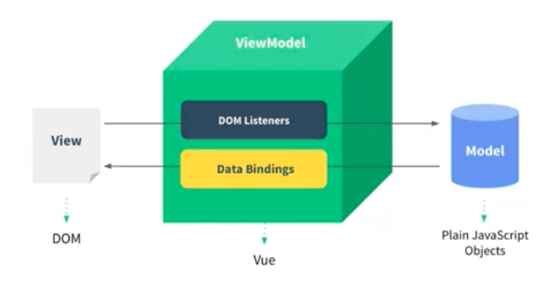
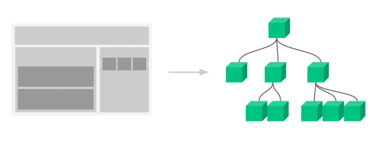
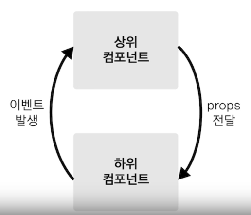
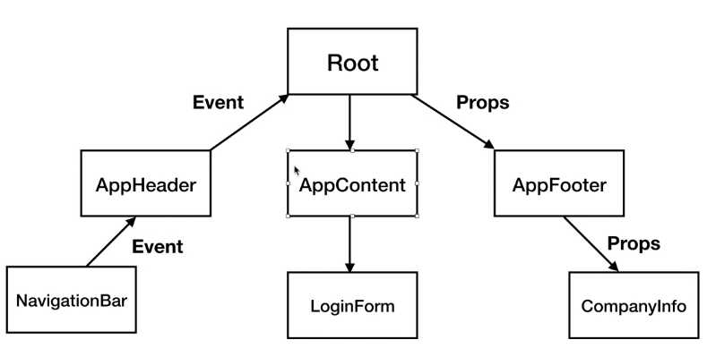

# Vue.js  
&nbsp;&nbsp;  
## Vue란?  
  
MVVM 패턴의 뷰 모델 레이어에 해당하는 화면단 라이브러리.  
쉽게말하면, DOM Listener DOM의 변화(이벤트)를 감지하고 이 데이터를 자바스크립트를 통해 조작하여 Data Bindings를 통해 데이터를 반영한다  
DOM Listener, Data Bindings하는 작업을 Vue.js가 한다.
&nbsp;&nbsp;  
## vue, js차이  
1. javaScript  
`````````
    <div id="app"></div>

    <script>
        const div = document.querySelector('#app');//app이라는 태그를 선택한다.
        console.log(div);
        //div.innerHTML="Hello word"//직접 dom에서 데이터를 넣어주는법과 자바스크립트에서는 이렇게 넣어주는 방식이 있다

        let str = "hello world";
        div.innerHTML=str;//str을 화면에 표시
        str = "hello world!!!" //기본 js에는 str의 스트링이 변해도 감지를 하지못한다.
        div.innerHTML=str;//이렇게 다시 str을 화면에 넣어줘야 데이터가 변화된다.
    </script>
`````````   

2. Vue  
`````````
    <div id="app">
        {{message}}
    </div>

    <script>
        let vm = new Vue({
            el: '#app',
            data: {
                message: 'hi' <--안의 메세지 데이터가 변화하면 그 변화를 감지하여 바로 변화된 데이터가 노출된다.
            },
        });
````````` 

&nbsp;&nbsp;  
## 뷰 가져오는 법  
`````
<!-- 개발버전, 도움되는 콘솔 경고를 포함. -->
<script src="https://cdn.jsdelivr.net/npm/vue/dist/vue.js"></script>

<!-- 상용버전, 속도와 용량이 최적화됨. -->
<script src="https://cdn.jsdelivr.net/npm/vue"></script>
`````
&nbsp;&nbsp;   


&nbsp;&nbsp;  
## 뷰 인스턴스  
개념: 인스턴스는 뷰로 개발할 때 필수로 생성해야되는 코드  

1. 인스턴스생성  
``````
    <div id="app"></div>

    <script>
        let vm = new Vue({//인스턴스를 생성
            el: '#app'//body태그 안에서 app이라는 아이디를 가진 태그를 찾아서 인스턴스(Vue)를 붙히겠다는 문구<--붙히는 순간에 뷰의 기능을 사용할 수 있게된다.
        });//뷰 인스턴스 생성
        console.log(vm);//뷰의 내용을 확인할 수 있다. 뷰의 API(기능)과 속성을 확인할 수 있다.
    </script>
``````

2. 인스턴스의 속성들  
`````
new Vue({
    el:,//인스턴스가 그려지는 화면의 시작점
    template:,//화면에 표시할 요소(html, css등)
    data:,//뷰의 반응성(Reactivity)가 반영된 데이터 속성
    methods:,//화면의 동작과 이벤트 로직을 제어하는 메서드
    created:,//뷰의 라이프 사이클과 관계된 속성
    watch:,//data에서 정의한 속성이 변화했을때 추가동작을 수행할 수 있게 정의하는 것
})
`````


## 뷰 컴포넌트 
   
개념: 컴포넌트는 화면의 영역을 구분하여 개발할 수 있는 뷰의기능이다.  
컴포넌트 기반으로 화면을 개발하게되면 재사용성이 올라가고 개발시간이 단축될 수 있다.  
또한 컴포넌트는 화면의 각파트 (Header, Footer, Main등)를 그림의 왼쪽과 같이 화면의 영역을 구분하여개발하는 것이며  
영역을 구분했을때 그림의 오른쪽과 같이 컴포넌트간의 관계가 생기게된다.  
  
## 전역 컴포넌트 등록  
````
    <div id="app">
        <!-- 밑에서 선언한 app-header라는 컴포넌트를 사용한다. -->
        <app-header></app-header>
        <app-content></app-content>
    </div>

    <script>
        //Vue.component('컴포넌트이름',컴포넌트내용);<--전역컴포넌트 선언 형식
        Vue.component('app-header',{//app-header라는 컴포넌트를 생성하여 화면에 태그를 표시한다(template)
            template:'<h1>header</h1>'
        })

        Vue.component('app-content',{
            template:'<div>content</div>'
        })
````  
  
## 지역 컴포넌트 등록  
`````
        new Vue({
            el: '#app',
            data: {
                message: 'hi'
            },
            components:{
                '컴포넌트 이름': {컴포넌트내용}  //지역컴포넌트는 components라는 속성을 넣은다음 컴포넌트를 작성해주면된다
            }
        });
`````  
  
## 컴포넌트 통신 방식  
  
개념: 뷰 컴포넌트는 각각의 유효한 데이터 범위를 가지며, 컴포넌트 간의 데이터를 주고 받기위해선 위의 그림과 같은 규칙이 있다.  
각각의 컴포넌트는 데이터를 따로 관리하며, 이 데이터들을 컴포넌트끼리 공유하는 방식은 이벤트발생과 props를 전달하는 방법이있다.   
  
### 데이터의 방향  
 
* 상위에서 하위 데이터를 내려줄 때는 props로 전달  
* 하위에서 상위로 데이터를 올려줄 때는 이벤트 발생으로 전달  
  
## Props 전달 방법  
1. 부모 컴포넌트 -> 자식 컴포넌트 (props로 전달(내려줌)) 
`````
    <!-- 여기서 아이디가 app인 div가 부모 컴포넌트가 되며, app-header 태그는 자식 컴포넌트가된다.
        여기서 v-bind로 전달해주는 props 속성이름은 자식컴포넌트 props속성(let appHeader의 속성)에서 설정해주고
        상위 컴포넌트 데이터 이름은 Root컴포넌트에서 data속성에서 선언한 message를 적어주면된다.
    -->
    <div id="app">
        <!-- props 전달 방법 형식
            <app-header v-bind:프롭스 속성 이름="상위 컴포넌트 데이터 이름"></app-header>
        -->
        <app-header v-bind:propsdata="message"></app-header>
    </div>

    <script>

        let appHeader = { 
                    //template에 직접 propsdata를 넣어준다
            template : '<h1>{{ propsdata}}</h1>',
            props: ['propsdata']
        }

        //Root 컴포넌트(부모컴포넌트)
        new Vue({
            el:'#app',
            components:{
                //app-header 컴포넌트(자식컴포넌트)
                'app-header': appHeader
            },
            data: {//Root Component(부모 컴포넌트에서 관리하는 데이터)
                message:'hi'
            }
        })
    </script>
`````  
  
2. 자식 컴포넌트 -> 부모 컴포넌트 (이벤트 발생(event emit)으로 전달)
* 선행적으로 알아야할 이벤트 속성
-  v-on:click="이벤트함수" : 클릭하면 일어나는 이벤트  
````
        <div id="app">
            <!-- <app-header v-on:하위 컴포넌트에서 발생한 이벤트 이름="상위 컴포넌트의 메서드 이름"></app-header>
            하위 컴포넌트에서 발생한 이벤트의 이름은 하위컴포넌트에서 만들어준 메서드 passEvent의 
            function안에서 선언해준 this.$emit('pass');에서 이벤트명으로 넣어준 pass를 넣어준다
            -->
            <app-header v-on:pass="logText"></app-header>
            <app-content v-on:increase="increaseNum"></app-content>
        </div>

        <script>
            let appHeader = {
                template:'<button v-on:click="passEvent">Click me</button> <br/>',
                methods: {
                    passEvent: function(){//vue develop tool에서 event 탭에가면 이벤트 이력을 확인할 수 있다. 
                        this.$emit('pass');
                    }
                }
            }

            let appContent = {
                template: '<button v-on:click="addNumber">add</button>',
                methods:{
                    addNumber: function(){
                        //this.$emit('이벤트명');
                        this.$emit("increase");
                    }
                }
            }
            
            new Vue({
                el:'#app',
                components:{
                    'app-header': appHeader,
                    'app-content': appContent
                },
                methods:{
                    logText:function(){
                        console.log('hi')
                    },
                    increaseNum:function(){
                        ++this.num;//컴포넌트 자신의 데이터는 this.데이터명으로 가져올 수 있다.
                    }
                },
                data:{
                    num:10
                }
            });
        </script>
````  

## vue에서의 this  
보통 자바스크립트에서의 this는 일반함수에서는 Global객체(window)를 의미하고,  
Object내에서의 메서드에서는 Object 자신을 의미한다.  
그렇다면, vue에서의 this는 어떤것일까? 아래의 간단한 예를 보자,  
`````
            new Vue({
                el:'#app',
                components:{
                    'app-header': appHeader,
                    'app-content': appContent
                },
                methods:{
                    logText:function(){
                        console.log('hi')
                    },
                    increaseNum:function(){
                        //메서드에서의 this는 해당 객체의 data를 바라보고 있다.
                        ++this.num;
                    }
                },
                data:{
                    num:10
                }
            });
`````  
위에서 보이는 것과 같이 increaseNum의 메서드에서는 뷰 객체의 num 데이터를 증가 시켜주는 기능을한다.  
여기서 num을 그냥 더하는것이 아닌, this.num이라고 작성되어있는것을 볼 수 있는데,  
이것이 의미하는 것은 뷰 객체의 메서드 내의 this는 Vue객체의 data를 향하고 있다는 것을 볼 수 있다.  
  
## 같은 레벨의 컴포넌트의 통신 방법  
s
